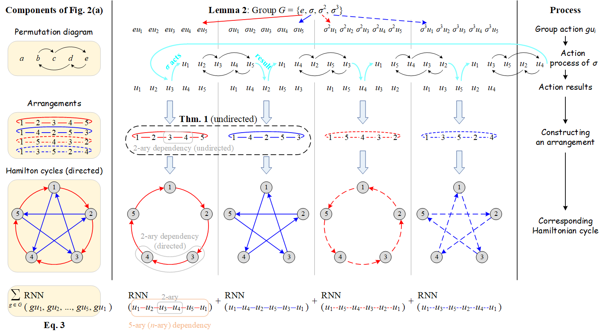

# Permutation Group Based Graph Neural Networks (PG-GNN)

The official implementation of **[Going Deeper into Permutation-Sensitive Graph Neural Networks](https://proceedings.mlr.press/v162/huang22l.html) (ICML 2022)**.
<!-- The complete illustrations of Figures 8(a) and 8(b) are provided in the folder `figures`. -->



## 1&nbsp; Installation

Follow the steps below to prepare the virtual environment.

Create and activate the environment:
```shell
conda create -n pggnn python=3.6
conda activate pggnn
```

Install dependencies:
```shell
pip install -r requirements.txt
```

## 2&nbsp; Experiments

### 2.1&nbsp; Synthetic Datasets

Reproduce the results reported in Table 2.
The results with different seeds and their corresponding epochs are summarized after each command.

#### Erdős–Rényi Random Graphs

```shell
python main_synthetic.py --dataset ER --task triangle --batch_size 16 --hidden_dim 64 --num_layers 5 --final_dropout 0.0 --lr_patience 20 --seed <seed>
```
where `<seed>` takes in {0, 2, 4, 6, 8}.

|        | seed 0 | seed 2 | seed 4 | seed 6 | seed 8 |
| :----- | :----: | :----: | :----: | :----: | :----: |
| Result | 0.020  | 0.017  | 0.021  | 0.022  | 0.016  |
| Epoch  | 506    | 369    | 506    | 380    | 537    |

```shell
python main_synthetic.py --dataset ER --task clique --batch_size 16 --hidden_dim 64 --num_layers 5 --final_dropout 0.0 --lr_patience 25 --seed <seed>
```
where `<seed>` takes in {0, 2, 4, 6, 8}.

|        | seed 0 | seed 2 | seed 4 | seed 6 | seed 8 |
| :----- | :----: | :----: | :----: | :----: | :----: |
| Result | 0.025  | 0.028  | 0.029  | 0.032  | 0.031  |
| Epoch  | 420    | 360    | 283    | 313    | 494    |

#### Random Regular Graphs

```shell
python main_synthetic.py --dataset regular --task triangle --batch_size 16 --hidden_dim 64 --num_layers 5 --final_dropout 0.0 --lr_patience 20 --seed <seed>
```
where `<seed>` takes in {0, 2, 4, 6, 8}.

|        | seed 0 | seed 2 | seed 4 | seed 6 | seed 8 |
| :----- | :----: | :----: | :----: | :----: | :----: |
| Result | 0.025  | 0.026  | 0.029  | 0.028  | 0.027  |
| Epoch  | 477    | 514    | 415    | 409    | 371    |

```shell
python main_synthetic.py --dataset regular --task clique --batch_size 16 --hidden_dim 64 --num_layers 5 --final_dropout 0.0 --lr_patience 20 --seed <seed>
```
where `<seed>` takes in {0, 2, 4, 6, 8}.

|        | seed 0 | seed 2 | seed 4 | seed 6 | seed 8 |
| :----- | :----: | :----: | :----: | :----: | :----: |
| Result | 0.023  | 0.023  | 0.024  | 0.021  | 0.022  |
| Epoch  | 340    | 283    | 324    | 475    | 336    |

### 2.2&nbsp; TUDataset

Reproduce the results reported in Table 3.
The results with different seeds and their corresponding epochs are summarized after each command.

#### PROTEINS

```shell
python main_tu.py --dataset PROTEINS --batch_size 16 --hidden_dim 8 --num_layers 5 --final_dropout 0.5 --graph_pooling_type sum --fold_idx <fold>
```
where `<fold>` takes from 0 to 9.

|        | seed 2     | seed 7     | seed 10    |
| :----- | :--------: | :--------: | :--------: |
| Result | 76.3 ± 2.7 | 76.8 ± 3.8 | 76.6 ± 4.6 |
| Epoch  | 135        | 168        | 261        |

#### NCI1

```shell
python main_tu.py --dataset NCI1 --batch_size 32 --hidden_dim 32 --num_layers 5 --final_dropout 0.0 --graph_pooling_type sum --fold_idx <fold>
```
where `<fold>` takes from 0 to 9.

|        | seed 2     | seed 7     | seed 10    |
| :----- | :--------: | :--------: | :--------: |
| Result | 82.5 ± 1.4 | 82.8 ± 1.3 | 83.4 ± 1.8 |
| Epoch  | 319        | 332        | 367        |

#### IMDB-BINARY

```shell
python main_tu.py --dataset IMDBBINARY --batch_size 16 --hidden_dim 16 --num_layers 5 --final_dropout 0.0 --graph_pooling_type sum --degree_as_tag --fold_idx <fold>
```
where `<fold>` takes from 0 to 9.
This command is used for the default seed 7.
For seeds 2 and 10, please change `--graph_pooling_type sum` to `--graph_pooling_type average`.
<!-- and leave other arguments/configurations unchanged. -->

|        | seed 2     | seed 7     | seed 10    |
| :----- | :--------: | :--------: | :--------: |
| Result | 77.1 ± 2.4 | 76.8 ± 2.6 | 76.8 ± 2.9 |
| Epoch  | 111        | 202        | 201        |
 
#### IMDB-MULTI

```shell
python main_tu.py --dataset IMDBMULTI --batch_size 32 --hidden_dim 16 --num_layers 5 --final_dropout 0.5 --graph_pooling_type sum --degree_as_tag --fold_idx <fold>
```
where `<fold>` takes from 0 to 9.

|        | seed 2     | seed 7     | seed 10    |
| :----- | :--------: | :--------: | :--------: |
| Result | 53.4 ± 4.0 | 53.2 ± 3.6 | 52.5 ± 3.5 |
| Epoch  | 114        | 251        | 203        |

#### COLLAB

```shell
python main_tu.py --dataset COLLAB --batch_size 32 --hidden_dim 64 --num_layers 3 --final_dropout 0.5 --graph_pooling_type sum --degree_as_tag --fold_idx <fold>
```
where `<fold>` takes from 0 to 9.
This command is used for the default seed 7.
For seeds 2 and 10, please change `--graph_pooling_type sum` to `--graph_pooling_type average`.

|        | seed 2     | seed 7     | seed 10    |
| :----- | :--------: | :--------: | :--------: |
| Result | 80.3 ± 1.9 | 80.9 ± 0.8 | 81.0 ± 1.7 |
| Epoch  | 105        | 363        | 133        |

### 2.3&nbsp; Benchmark Datasets

Download the datasets and reproduce the results reported in Table 4.

#### Download Datasets

Follow the instructions below to download Benchmark datasets.
You can also follow the instructions provided on the [official website](https://github.com/graphdeeplearning/benchmarking-gnns) of Benchmark datasets.

```shell
cd data/ 
bash script_download_superpixels.sh
```

The script `script_download_superpixels.sh` is located [here](data/script_download_superpixels.sh).
If downloaded correctly, the file for MNIST can be found at `data/superpixels/MNIST.pkl`.

```shell
cd data/ 
bash script_download_molecules.sh
```

The script `script_download_molecules.sh` is located [here](data/script_download_molecules.sh).
If downloaded correctly, the file for ZINC can be found at `data/molecules/ZINC.pkl`.

#### MNIST

```shell
python main_benchmark.py --dataset MNIST --batch_size 64 --hidden_dim 128 --num_layers 5 --final_dropout 0.0 --lr_patience 20 --graph_pooling_type average --seed <seed>
```
where `<seed>` takes in {0, 3, 6, 9}.

|        | seed 0 | seed 3 | seed 6 | seed 9 |
| :----- | :----: | :----: | :----: | :----: |
| Result | 97.39  | 97.52  | 97.54  | 97.56  |
| Epoch  | 266    | 268    | 251    | 198    |

#### ZINC

```shell
python main_benchmark.py --dataset ZINC --batch_size 64 --hidden_dim 128 --num_layers 5 --final_dropout 0.0 --lr_patience 25 --graph_pooling_type sum --seed <seed>
```
where `<seed>` takes in {0, 3, 6, 9}.

|        | seed 0 | seed 3 | seed 6 | seed 9 |
| :----- | :----: | :----: | :----: | :----: |
| Result | 0.298  | 0.286  | 0.277  | 0.269  |
| Epoch  | 422    | 424    | 391    | 443    |

### 2.4&nbsp; Numerical Simulation

We provide the IPython Notebook file `simulation.ipynb` to reproduce the results of numerical experiments reported in Figure 9 (Appendix K.2).

<!-- ## 3&nbsp; Questions and Contact

Please feel free to contact Zhongyu Huang (huangzhongyu2020@ia.ac.cn) if you have any questions. -->

## 3&nbsp; Cite

If you find this code or our PG-GNN paper helpful for your research, please cite our paper:

```bibtex
@inproceedings{huang2022going,
  title     = {Going Deeper into Permutation-Sensitive Graph Neural Networks},
  author    = {Huang, Zhongyu and Wang, Yingheng and Li, Chaozhuo and He, Huiguang},
  booktitle = {Proceedings of the 39th International Conference on Machine Learning},
  pages     = {9377--9409},
  year      = {2022},
  editor    = {Chaudhuri, Kamalika and Jegelka, Stefanie and Song, Le and Szepesvari, Csaba and Niu, Gang and Sabato, Sivan},
  volume    = {162},
  series    = {Proceedings of Machine Learning Research},
  month     = {17--23 Jul},
  publisher = {PMLR}
}
```
